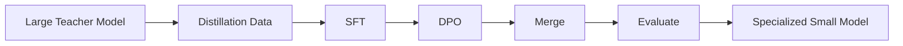
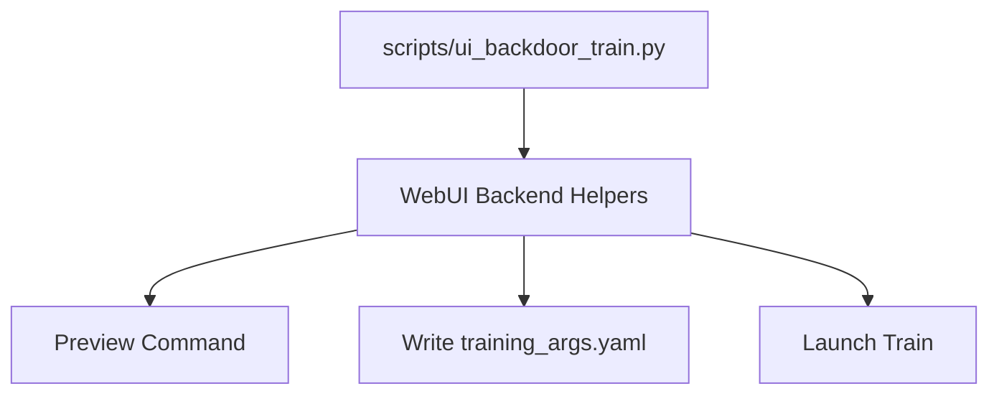

# Executive Deck (8 Slides)
## Big LLM -> Small Specialized Model (EN/RO/FR/HU + OCR + Chat)

---

## Slide 1: Executive Summary

Goal:

- Convert a large general model into a smaller focused model.
- Keep quality for:
  - English, Romanian, French, Hungarian.
  - OCR cleanup and understanding.
  - Chat in those four languages.
- Reject unsupported languages.

Outcome so far:

- Backdoor workflow built and validated.
- Local SFT run completed successfully.
- Language-gate evaluation path wired and tested.

---

## Slide 2: Why This Matters

Business value:

- Faster inference.
- Lower runtime cost.
- Smaller deployment footprint.
- Better consistency on target tasks.

Strategic value:

- Focus model behavior on your exact product scope.
- Reduce unwanted off-domain responses.

---

## Slide 3: Process Overview (Visual)

---

## Slide 4: Implementation Approach (No UI Clicking)

We used a backend-equivalent "UI backdoor" workflow.

Key point:

- Same backend logic as UI, without manual button operations.

---

## Slide 5: Assets Delivered

Core assets created or updated:

- Backdoor launcher:
  - scripts/ui_backdoor_train.py
- Distillation templates:
  - examples/distillation/gemma4_student_sft_ui_backdoor_template.yaml
  - examples/distillation/gemma4_student_dpo_ui_backdoor_template.yaml
  - examples/merge_lora/gemma4_student_merge_ui_backdoor_template.yaml
- Datasets:
  - data/distill_ocr_chat_translate_4lang_train.jsonl
  - data/distill_ocr_chat_translate_4lang_pref.jsonl
  - data/lang_gate_eval_4lang.jsonl
- Evaluator:
  - scripts/eval_lang_gate_4lang.py

---

## Slide 6: Execution Status

Completed:

- Data schema and dataset wiring.
- Local-compatible SFT execution (successful).
- Local-compatible DPO execution (successful).
- Local merge execution (successful).
- Real language-gate run on merged model (completed).

Evidence artifacts:

- saves/gemma4_student/lora/sft_local/train_results.json
- saves/gemma4_student/lora/dpo_local
- saves/gemma4_student/merged/four_lang_ocr_chat_local
- benchmark_output/lang_gate/report_local_merged.json (score: 0.50)
- benchmark_output/lang_gate/report_local_merged_policy.json (score: 0.60)
- benchmark_output/lang_gate/report_local_merged_policy_guarded.json (score: 1.00)

---

## Slide 7: Risks and Mitigations

Risk 1: Environment mismatch (wrong Python/CLI)

- Mitigation: launcher pinned to intended interpreter/module path.

Risk 2: Hardware mismatch (bf16/GPU profile on unsupported machine)

- Mitigation: local-safe profile for pipeline validation.

Risk 3: Policy drift outside 4 languages

- Mitigation: targeted SFT+DPO data plus language-gate evaluation.

---

## Slide 8: Next 3 Actions

1. Move this exact guarded inference pattern into app/runtime integration.
2. Run the same flow on target GPU profile (Gemma-class teacher/student config).
3. Add OCR/translation quality benchmarks (CER/WER, BLEU/chrF/COMET) for release gating.

Success criteria:

- High pass-rate on allowed-language tasks.
- Consistent refusal for unsupported languages.
- OCR cleanup remains faithful.
