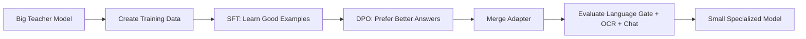
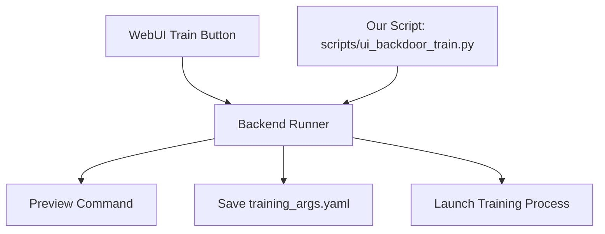
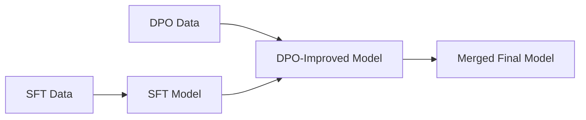

# Distillation Presentation (Non-Expert Friendly)
## From Big LLM to Small Specialized Model

Author: Project walkthrough based on this repo work
Date: 2026-04-05

---

## Slide 1: The Big Picture

We started with one goal:

- Take a complex, powerful LLM (teacher).
- Build a smaller, cheaper, faster LLM (student).
- Keep only these skills:
  - English, Romanian, French, Hungarian.
  - OCR cleanup and understanding.
  - Chat quality in those four languages.
- Reject unsupported languages.

Simple analogy:

- Teacher model = senior chef who knows every cuisine.
- Student model = focused chef trained for one menu.

---

## Slide 2: Why Distillation?

Distillation gives us:

- Lower cost to run.
- Faster responses.
- Smaller model footprint.
- Domain focus instead of general noise.

Tradeoff:

- We lose some broad general capability.
- We gain better behavior on our target tasks.

---

## Slide 3: Visual Flow (High Level)



---

## Slide 4: What "UI Backdoor" Means

We did not click buttons in the UI.
We used the same backend path the UI uses internally.

Visual:



Key point:

- No manual UI clicking.
- Same backend logic.

---

## Slide 5: Data We Prepared

We created and registered datasets for this specialization.

- SFT dataset:
  - data/distill_ocr_chat_translate_4lang_train.jsonl
- DPO preference dataset:
  - data/distill_ocr_chat_translate_4lang_pref.jsonl
- Dataset registry:
  - data/dataset_info.json
- Language-gate eval spec:
  - data/lang_gate_eval_4lang.jsonl

---

## Slide 6: Dataset Schema (Simple)

SFT rows teach correct behavior:

```text
instruction: what to do
input: user content
output: correct answer
```

DPO rows teach preference:

```text
prompt: task
chosen: better answer
rejected: worse answer
```

Language gate eval rows:

```text
id, prompt, input_language, should_answer
```

Predictions file rows:

```text
id, response
```

---

## Slide 7: Training Stages Explained

1. SFT (Supervised Fine-Tuning)
- Student learns by imitation from good examples.

2. DPO (Direct Preference Optimization)
- Student learns to choose better outputs over weaker outputs.

3. Merge
- Adapter is merged into a final model package.

Visual:



---

## Slide 8: What Actually Happened in This Repo

Implemented artifacts:

- Backdoor launcher script:
  - scripts/ui_backdoor_train.py
- Config templates:
  - examples/distillation/gemma4_student_sft_ui_backdoor_template.yaml
  - examples/distillation/gemma4_student_dpo_ui_backdoor_template.yaml
  - examples/merge_lora/gemma4_student_merge_ui_backdoor_template.yaml
- Full playbook doc:
  - docs/en/advanced/ui-backdoor-gemma4-distillation-playbook.md
- Evaluator script:
  - scripts/eval_lang_gate_4lang.py

---

## Slide 9: Problems We Hit (Normal in Real Projects)

Problem 1: Wrong Python/CLI environment

- Training command picked the wrong global environment.

Fix:

- Launcher updated to use the intended interpreter/module path.

Problem 2: Hardware mode mismatch

- Target profile expected bf16/GPU support.
- Local machine could not run that mode.

Fix:

- Created a local-compatible SFT profile for proof run.

---

## Slide 10: Result We Confirmed

The local compatible SFT run completed successfully.

Output folder:

- saves/gemma4_student/lora/sft_local

Training metrics file:

- saves/gemma4_student/lora/sft_local/train_results.json

Language-gate evaluator also ran end-to-end.

Report output:

- benchmark_output/smoke/lang_gate_eval_report.json

---

## Slide 11: Visual Timeline

```mermaid
gantt
    title Distillation Work Timeline (This Run)
    dateFormat  HH:mm
    axisFormat %H:%M
    section Setup
    Backdoor launcher + configs       :done, a1, 09:00, 90m
    section Data
    SFT/DPO datasets + registry       :done, a2, after a1, 60m
    section Training
    Target run attempts + fixes       :done, a3, after a2, 70m
    Local-safe SFT successful run     :done, a4, after a3, 30m
    section Evaluation
    Language-gate evaluator wiring    :done, a5, after a4, 25m
```



---

## Slide 12: Architecture Drawing (Simple)

```text
+---------------------------+
| Teacher Model (Large LLM) |
+-------------+-------------+
              |
              | generate/curate examples
              v
+---------------------------+
| Distillation Datasets     |
| - SFT train               |
| - DPO preference          |
+-------------+-------------+
              |
              v
+---------------------------+
| Student Training          |
| 1) SFT                    |
| 2) DPO                    |
| 3) Merge                  |
+-------------+-------------+
              |
              v
+---------------------------+
| Small Specialized Model   |
| EN/RO/FR/HU + OCR + Chat  |
| Reject unsupported langs  |
+-------------+-------------+
              |
              v
+---------------------------+
| Evaluation                |
| Language-gate + quality   |
+---------------------------+
```

---

## Slide 13: What This Means for You

You now have:

- A repeatable no-click training workflow.
- Prepared datasets and schemas.
- A working evaluator path.
- A successful local SFT proof run.

You are ready for:

- Full GPU target run.
- DPO run on top of SFT.
- Merge and final model validation.

---

## Slide 14: Beginner-Friendly Next Steps

1. Run target SFT on proper GPU profile.
2. Run DPO with the preference set.
3. Merge final adapter/model.
4. Generate predictions on eval set.
5. Run language-gate evaluator and track score trend.

Success criteria:

- Answers allowed languages well.
- Refuses unsupported languages consistently.
- OCR cleanup is faithful and stable.

---

## Slide 15: One-Sentence Summary

We built a practical pipeline that teaches a small model to do your exact 4-language OCR/chat job, verified the workflow locally end-to-end, and prepared it for full target training on proper hardware.
